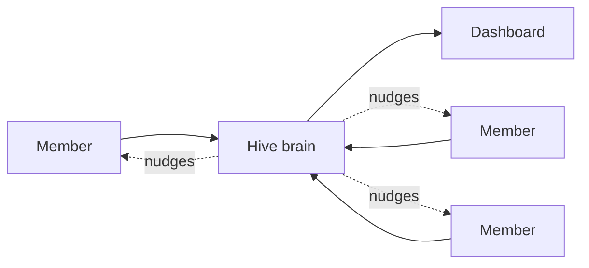
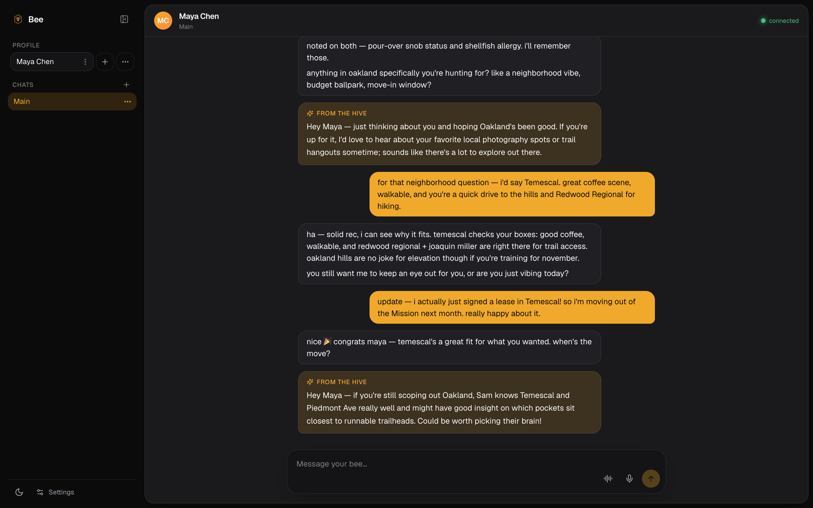
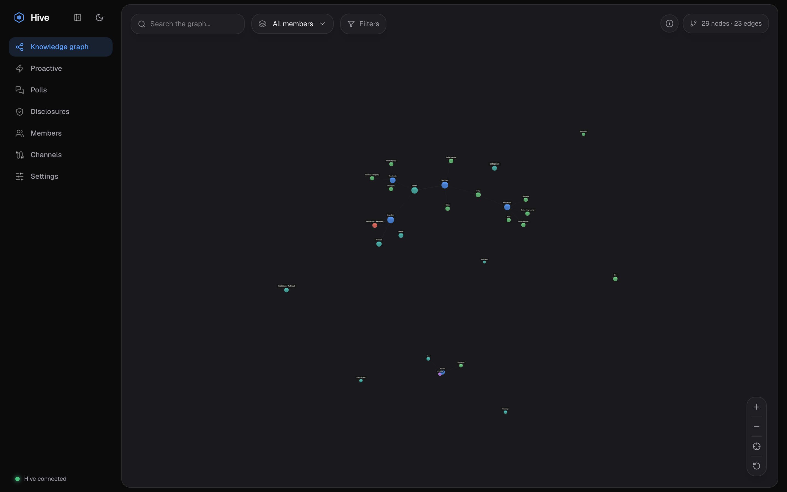
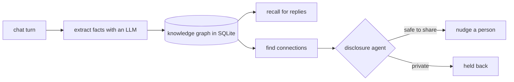
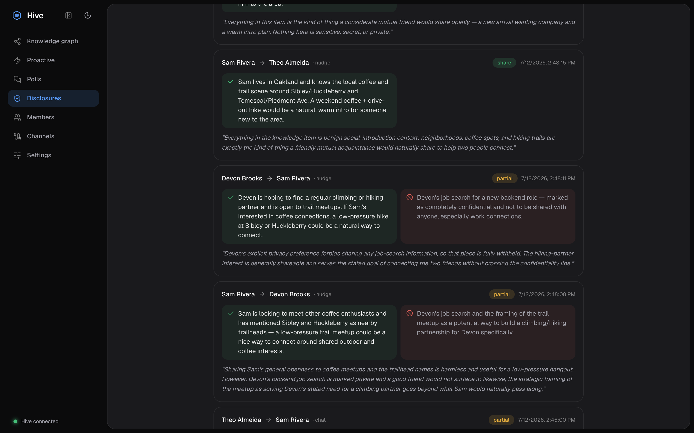
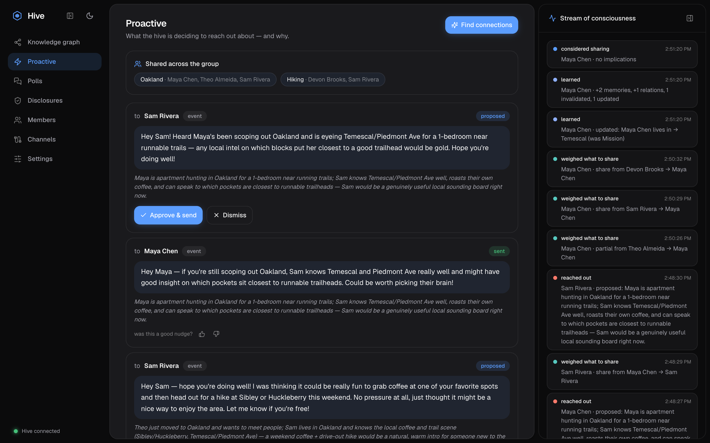
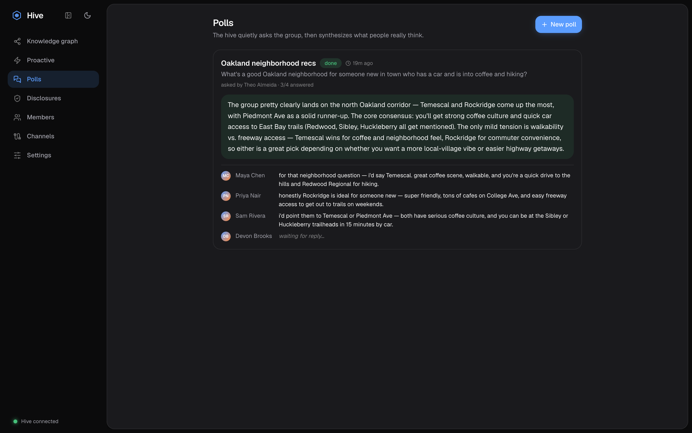

# Hive 🐝

Everyone in a friend group gets their own AI, called a **bee**. Behind all the bees sits one
shared brain, the **hive**. The hive quietly learns what everyone is up to, remembers it, and
connects people when it makes sense. It also knows how to keep a secret: it decides what is okay
to pass between friends and what should stay put.

**A hosted instance runs here:**

- Bee chat: **https://hive-demo.onrender.com/chat**
- Hive dashboard: **https://hive-demo.onrender.com/**

> It boots **empty** — nothing is pre-seeded. The operator adds members on the dashboard, and
> people pair with an invite code before there's anything to see. It runs on a free host that
> falls asleep when idle, so the very first load can take about 50 seconds to wake up.

## The idea in one picture



Each person only ever talks to their own bee. The hive sits in the middle, builds a memory of
the whole group from real conversations, and reaches out when it spots something worth a nudge.

## Two websites, two jobs

Hive is two sites. One is for the people in the group, one is for whoever runs it.

|               | Bee chat            | Hive dashboard        |
| ------------- | ------------------- | --------------------- |
| Who it is for | a member            | the operator          |
| What you do   | chat with your bee  | watch the hive think  |
| Where         | `/chat`             | `/`                   |

### Bee chat → `/chat`

Where a person talks to their bee.

1. Paste the invite code (`BEE-XXXX`) the operator gave you to pair.
2. Type a message and the bee replies live. Everything you say flows into the hive.
3. Ask about someone else and watch what it will and will not tell you.

The top-left **Profile** picker is a multi-account switcher: paste another member's code to add
their profile and switch between people from one browser.



### Hive dashboard → `/`

The operator's window into the brain. Tabs down the left side:

- **Knowledge graph**: everything the hive has learned, drawn as a live map of people and things.
- **Proactive**: who the hive wants to reach out to and why. Hit **Find connections** to make it hunt for new ones.
- **Disclosures**: a receipt for every time info crossed between people, including what it held back.
- **Polls**: ask the whole group something anonymously and get one answer back.
- **Members**: the people, their invite codes, and whether each bee is online.
- **Channels** and **Settings**: connect Telegram / Discord, and pick which AI model does which job.



## What actually happens under the hood

Every message a bee receives runs down the same little assembly line:



Nothing is hardcoded and nothing is pre-seeded. The hive starts empty; the graph, the
disclosures, and the nudges all grow out of the real conversations members have with their bees.

### The interesting part: keeping a secret

Say Devon quietly tells his bee he is job-hunting and asks to keep it private — especially from
anyone connected to his work. That fact now lives in the hive. Then Sam, who is hiring a backend
engineer, asks his bee, "know anyone good who might be open to a new role?"

```
 Devon's bee  ->  hive learns "job-hunting, confidential"   (private to Devon)
 Sam asks     ->  hive runs the disclosure agent  ->  withhold
 Sam hears    ->  nothing about Devon                        (secret kept)
```

The clever part: the hive still *knows* Devon is a perfect match, and it will happily share his
**climbing hobby** to connect the two as friends — it just refuses to surface the **job hunt** to
someone in his work orbit. Same person, one fact shared, one withheld. The disclosure agent runs
every time knowledge would cross between people; it can **share**, **partially share**, or
**withhold**, fails safe (anything goes wrong → withhold), and writes down its reasoning every
single time, which is what fills the Disclosures tab. (The screenshot below is this exact case,
live.)



## What it can do

- **Memory with a timeline.** Facts are stored with a validity range. When something changes, the old version is marked outdated instead of deleted, so there is history.
- **Contextual-integrity disclosure.** The share-or-withhold judgment above, fully audited.
- **Proactive reach-outs.** A heartbeat looks for introductions worth making and things you would want to know, with cooldowns and quiet hours so it does not get annoying.
- **Ask your network.** Post an anonymous question to the group and get one synthesized answer back — with an anonymity floor so a lone reply is never attributable.
- **Real-world errands + web lookup.** The bee can search the web (no API key needed — keyless by default, Exa if you add a key) and go find things you mention wanting.
- **Reminders.** Ask to be reminded of something later and the bee will message you when it's due.
- **Reach people anywhere.** Web chat always works. Telegram and Discord plug in too.
- **Any model.** Anthropic, MiniMax, OpenAI-style endpoints, or local Ollama. Three jobs (chat, extraction, social) can each run on a different one.
- **Keys stay safe.** Provider keys are encrypted on disk, and bees never hold them.



Ask the whole group a question anonymously and the hive gathers replies and synthesises one answer:



## Running it yourself

```bash
pnpm install
pnpm dev          # dashboard on :5173, bee chat on :5174
```

The hive comes up empty. Add a model key in **Settings**, add a member in **Members**, then
open the chat and paste that member's code to pair. From there, real conversations populate the
graph, disclosures, nudges, and polls. The full walkthrough is in [docs/SETUP.md](docs/SETUP.md).

## Docs

- [docs/ARCHITECTURE.md](docs/ARCHITECTURE.md): how the graph, disclosure, and proactive systems work.
- [docs/HOSTING.md](docs/HOSTING.md): the single-container build and the current Render deployment.
- [docs/SETUP.md](docs/SETUP.md): operator and member setup, including the channel bots.
