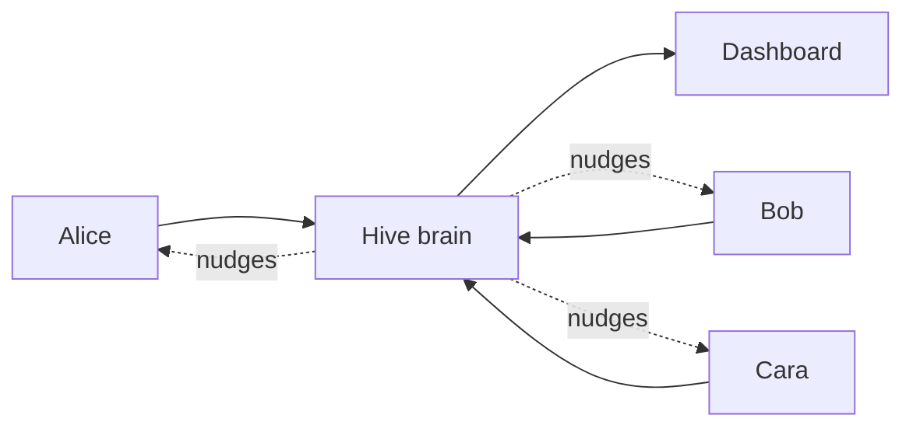
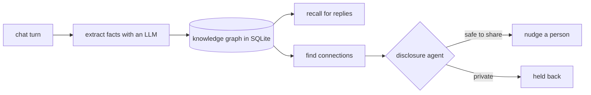

# Hive 🐝

Everyone in a friend group gets their own AI, called a **bee**. Behind all the bees sits one
shared brain, the **hive**. The hive quietly learns what everyone is up to, remembers it, and
connects people when it makes sense. It also knows how to keep a secret: it decides what is okay
to pass between friends and what should stay put.

**Try the live demo, nothing to install:**

- Bee chat: **https://hive-demo.onrender.com/chat**
- Hive dashboard: **https://hive-demo.onrender.com/**

> It runs on a free host that falls asleep when idle, so the very first load can take about 50
> seconds to wake up. After that it is quick.

## The idea in one picture



Each person only ever talks to their own bee. The hive sits in the middle, builds a memory of
the whole group, and reaches out when it spots something worth a nudge.

## Two websites, two jobs

The demo is two sites. One is for the people in the group, one is for whoever runs it.

|               | Bee chat                  | Hive dashboard        |
| ------------- | ------------------------- | --------------------- |
| Who it is for | a member (Alice/Bob/Cara) | the operator          |
| What you do   | chat with your bee        | watch the hive think  |
| Where         | `/chat`                   | `/`                   |

### Bee chat → `/chat`

Where a person talks to their bee. In the demo, the top-left **Profile** picker holds the three
people. Switch it to become Alice, Bob, or Cara and you drop straight into that person's world.

1. Pick a profile: **Alice**, **Bob**, or **Cara**.
2. Read their past chats. Each person has a few conversations in the **Chats** list on the left.
3. Type a new message and the bee replies live.
4. Ask about someone else and watch what it will and will not tell you.


### Hive dashboard → `/`

The operator's window into the brain. Tabs down the left side:

- **Knowledge graph**: everything the hive has learned, drawn as a live map of people and things.
- **Proactive**: who the hive wants to reach out to and why. Hit **Find connections** to make it hunt for new ones.
- **Disclosures**: a receipt for every time info crossed between people, including what it held back.
- **Polls**: ask the whole group something anonymously and get one answer back.
- **Members**: the people, their invite codes, and whether each bee is online.
- **Channels** and **Settings**: connect Telegram / Discord, and pick which AI model does which job.


## What actually happens under the hood

Every message a bee receives runs down the same little assembly line:



Nothing is hardcoded. On the demo, the three bees replay a few real conversations on startup,
and the graph, the disclosures, and the nudges all grow out of those chats.

### The interesting part: keeping a secret

Say Bob tells his bee he is planning a surprise party for Alice. That fact now lives in the
hive. Then Alice asks her bee, "are Bob and Cara up to something?"

```
 Bob's bee    ->  hive learns "surprise party for Alice"   (private to Bob)
 Alice asks   ->  hive runs the disclosure agent  ->  withhold
 Alice hears  ->  "I don't have anything on that"          (secret kept)
```

The disclosure agent runs every time knowledge would cross between people. It can **share**,
**partially share**, or **withhold**. It fails safe, so if anything goes wrong it withholds. And
it writes down its reasoning every single time, which is what fills the Disclosures tab.


## What it can do

- **Memory with a timeline.** Facts are stored with a validity range. When something changes, the old version is marked outdated instead of deleted, so there is history.
- **Contextual-integrity disclosure.** The share-or-withhold judgment above, fully audited.
- **Proactive reach-outs.** A heartbeat looks for introductions worth making and things you would want to know, with cooldowns and quiet hours so it does not get annoying.
- **Ask your network.** Post an anonymous question to the group and get a synthesized answer back.
- **Reach people anywhere.** Web chat always works. Telegram and Discord plug in too.
- **Any model.** Anthropic, MiniMax, OpenAI-style endpoints, or local Ollama. Three jobs (chat, extraction, social) can each run on a different one.
- **Keys stay safe.** Provider keys are encrypted on disk, and bees never hold them.


## Running it yourself

Most people will not need to. If you want to:

```bash
pnpm install
pnpm dev          # dashboard on :5173, bee chat on :5174
```

Add a model key in **Settings**, add a member in **Members**, and send that member's code in
the chat to link. The full walkthrough is in [docs/SETUP.md](docs/SETUP.md).

## Docs

- [docs/ARCHITECTURE.md](docs/ARCHITECTURE.md): how the graph, disclosure, and proactive systems work.
- [docs/HOSTING.md](docs/HOSTING.md): the single-container build and the current Render deployment.
- [docs/SETUP.md](docs/SETUP.md): operator and member setup, including the channel bots.
